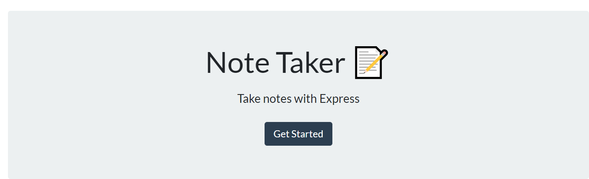
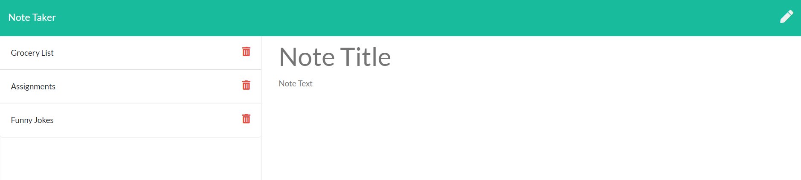

:part_alternation_mark:

# WEB-NOTE-APP

A Note Taking Web App. 
Running on Heroku, using Node.js with Express framework. 
Notes are saved in json file on server. 

User is able to add notes with a title to be saved into a json file. 
User can Delete and view previously saved notes. 

>Link to page https://web-note-application.herokuapp.com/

 
 

## WEB-NOTE-APP Description and Goal
---

 

>Web Note Taker Application

>User has ability to add a note with a title. 

>Once both fields are filled a save button appears

>When the user clicks on the save button the note is added 
to the side bar.

>Additional Notes are added to the side bar and are stored in a JSON file on the server

>The user is able to select a previously saved note and view it in the main display which becomes read-only. 

>When the user selects to make a new note the fields are made blank and are turned back to read/write

>User us able to delete saved notes from the side bar and from the server

 
 

## Credits
---
:school: 
**University of Toronto Continuing Educationg
Full Stack Flex Program** - *Initial HTML and CSS*
:school:

:heart: 
*Students and Instructors At the UFT-FSF-2020-2021*
:heart:

 

## License
---

All rights reserved.

Licensed under the MIT license.
 

 

:lock::lock::lock::lock:

_____
____
___